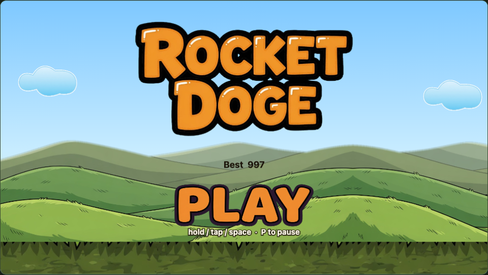

<p align="center">
  
</p>

# Rocket Doge

**Hold to fly. Dodge everything. Much wow.**

A 2026 rewrite of the 2014 endless runner: Doge with a jetpack, rolling hills, and a sky full of trouble. Tap, click, or hold space. The rocket does the rest.

[Play it](https://rocket-doge.vercel.app) · [Play locally](#run-it) · Upgraded from the 2014 ImpactJS original · UI built with [SvenJS 3.2.1](https://svenjs.xyz/)

## Why you will keep tapping

- **One-button flight.** Hold to burn boost, release to fall. That is the whole control scheme.
- **Seven enemies**, each with a different job: crabs on the grass, bluejays in sine waves, spike mines, dashing roboskulls, meteors, balloon cats, and a tracking UFO.
- **Fairer than 2014.** Three hearts, i-frames, and pickups that actually matter — jetpack fuel is a real gulp, hearts give a life back.
- **It looks like a cartoon.** New sprites, walk and fly cycles, a looping hillside, clouds that hang around.
- **It sounds like a cartoon.** Chiptune under the sky, boings and honks when you eat dirt.

## How to play

| Input | Action |
| --- | --- |
| Hold / tap / space | Thrust |
| Release | Fall |
| P / Esc | Pause |

Collect coins for score. Grab the teal jetpack for **much boost**. Grab a heart if you are down a life. Distance plus coins is the score. Beat your best — it lives in `localStorage`.

## Enemies

| | Behaviour |
| --- | --- |
| **Crab** | Walks the ground. Do not land on it. |
| **Bluejay** | Sine-wave flyer. Later they come in pairs. |
| **Spike mine** | Hangs in the air and pulses. Go over or under. |
| **Roboskull** | Hovers, then dashes. Late-game tunnels of them. |
| **Meteor** | Falls diagonally. Do not share the sky. |
| **Balloon cat** | Big, slow, occupies the middle. |
| **UFO** | Tracks your altitude. Rude. |

## Run it

Requires Node 20+.

```bash
npm install
npm run dev
```

Open [http://localhost:5173](http://localhost:5173). `npm run build` / `npm run preview` for a production bundle.

## Stack

Vite, TypeScript, Canvas 2D, [SvenJS 3.2.1](https://svenjs.xyz/) for the shell. No ImpactJS in the playable path.

## License

[MIT](LICENSE)
